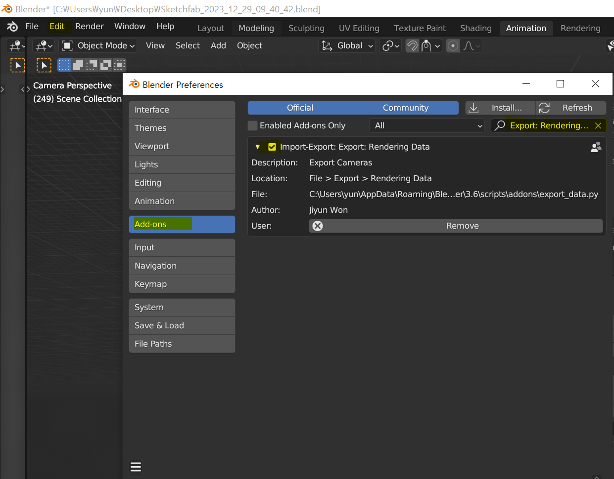

## Blender Addon for Export Rendering Data
This is Blender Addon for Export Rendering Data. If you install this addon and export data, then you can get camera matrixes(3x3 intrinsic matrix, 4x4 extrinsic matrix), depth images(32bit hdr image) and rendered images per frame.

### Installation
1. Download `export_data.py`.
2. Open Blender and select Edit -> Preferences -> Addons.
3. At the top right of the window, press Install button.
4. Select the downloaded file `export_data.py` and press Install Addon.
5. Search for "Export: Rendering Data" using Perspective Views of Rectangles in the addon list.
6. Activate the checkbox to use the addon. (If you want to keep the addon activated when blender restarts, open the menu (bottom left menu button) and choose Save Preferences.)
  
  
### Output File Structure
```
  root
    L camera
      L intrinsic
        L 001.npy (3x3 matrix)
        L 002.npy
        ...
      L extrinsic
        L 001.npy (4x4 matrix)
        L 002.npy
        ...
    L depth
      L Image0001.hdr (32bit)
      L Image0002.hdr
      ...
    L rgb
      L 001.jpg
      L 002.jpg
      ...
```
